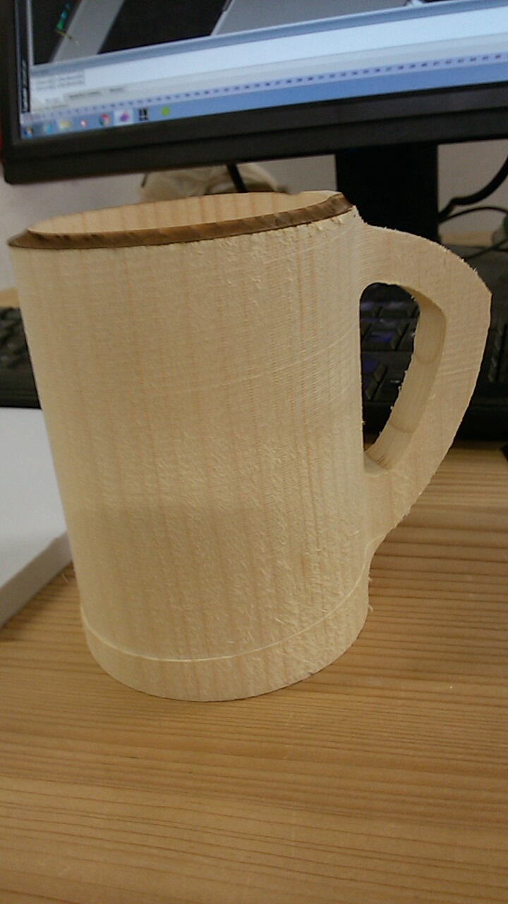
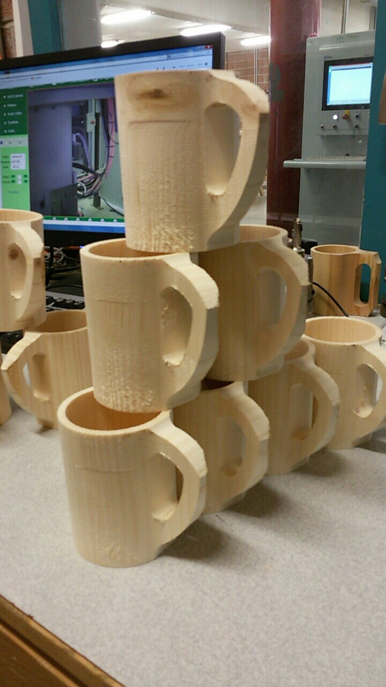

Depuis maintenant 3 ans, je suis une formation dans le bois (3 ans de bac professionnel en agencement puis 2 ans en BTS Développement Réalisation Bois). Le but de celle-ci est de nous former à l'utilisation de machines à commandes numériques ainsi qu'à la conception de produits divers et variés.
Durant les deux prochaines années, nous allons beaucoup travailler sur un centre d'usinage 5 axes homag : La Venture 16L. J'en profiterai donc pour vous partager certaines réalisations.

### Réalisation du projet

Pour commencer le début de l'année, nous avons réalisé une série d'une vingtaines de chope en bois. L'usinage était plutôt rapide (moins de 4 minutes) pour la quantité de matière à enlever (plus de 80% du  bloc initial !!). Pour commencé le projet, nous avons fait deux pièces d'essai pour réajuster les usinages (profondeur de passe de l'outil, vitesse d'usinage, ...). Heureusement que les fabrications en série on toujours une session d'essai sinon on aurai pu jeter toute notre série à cause d'un soucis de longueur d'outil. Le haut de la chope avait brulé à cause d'un frotement entre la base de l'outil et la chope en elle même et une trace d'usinage apparaissait à la base de celle-ci.

Une fois tout les defauts réglés, nous avons pu commencé production.

<iframe width="560" height="315" src="https://www.youtube.com/embed/3yHgas_f79E?rel=0&amp;showinfo=0" frameborder="0" allowfullscreen></iframe>

**Timeline**
00:00 : Surfacage du dessus de la chope
00:28 : Réalisation de l'extérieur de la chope
01:29 : Réalisation de l'interieur de la chope
02:11 : Contournage de la anse
02:40 : Réalisation de l'ouverture la anse
03:12 : Séparation de la chope de son support initial

Sur un total de 22 chopes réalisé, 7 n'étaient pas utilisables du à des défauts dans le bois (trou dans le bois, arrachement de la anse à cause de la préssion exercé sur le bois pendant l'usinage, fissure dans le bois, ...).

La fabrication terminé, tout est donné au client qui ce chargera lui même des finition (ponsage, reprise de petit details, application d'huile ou vernis protecteur).

Pour ma part, un ponsage avec du papier de verre de grain 80, 120 et 180 s'impose.

### Sources :
Image de une par [Höchsmann](https://www.hoechsmann.com/)