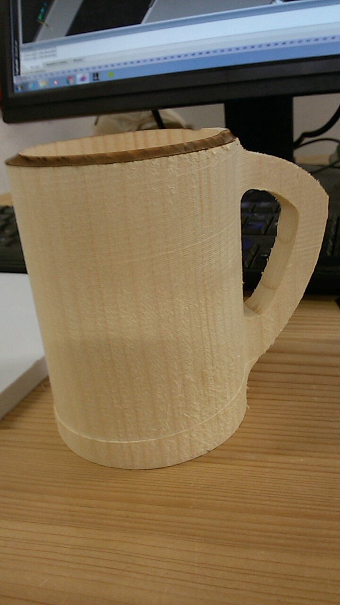
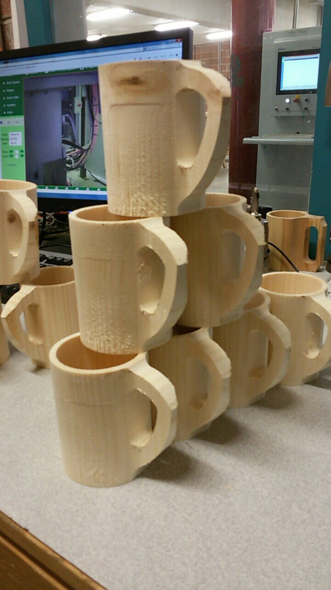
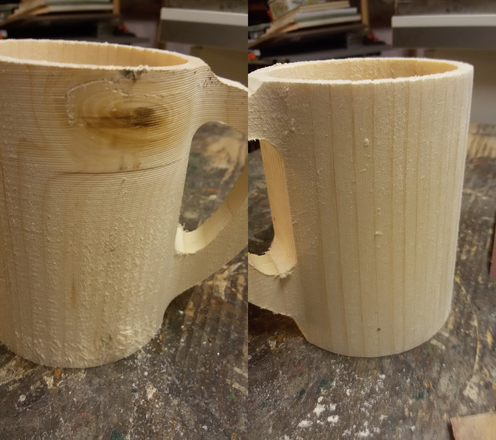
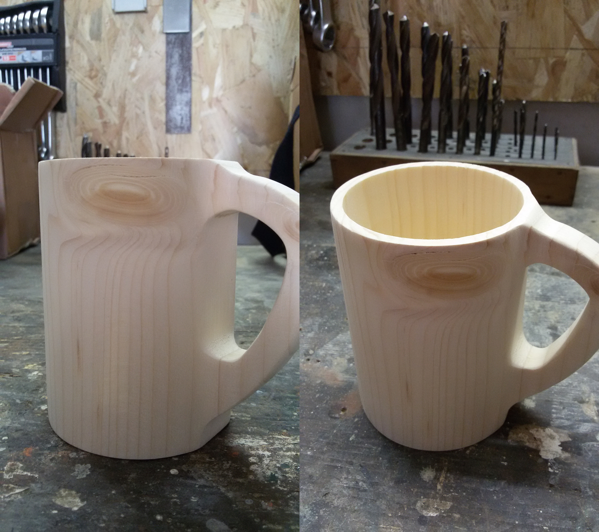

Depuis maintenant 3 ans, je suis une formation dans le bois (3 ans de bac professionnel en agencement puis 2 ans en BTS Développement Réalisation Bois). Le but de celle-ci est de nous former à l'utilisation de machines à commandes numériques ainsi qu'à la conception de produits divers et variés.
Durant les deux prochaines années, nous allons beaucoup travailler sur un centre d'usinage 5 axes homag : La Venture 16L. J'en profiterai donc pour vous partager certaines réalisations sachant qu'il y a une petite caméra fixée dans la machine.

### Réalisation du projet

Pour commencer le début de l'année, nous avons réalisé une série d'une vingtaine de chopes en bois. L'usinage était plutôt rapide (moins de 4 minutes) pour la quantité de matière à enlever (plus de 80% du bloc initial !!). Pour commencer le projet, nous avons réalisé deux pièces d'essai pour réajuster les usinages (profondeur de passe de l'outil, vitesse d'usinage, ...). Grâce à ces pièces d'essais, nous avons pu nous apercevoir qu'il y avait l'un ou l'autre défaut de fabrication. Le haut de la chope avait brûlé à cause d'un frottement entre la base de l'outil et la chope en elle-même et cela avait entraîné une trace d'usinage apparaissait à la base de celle-ci.

Une fois tous les défauts réglés, nous avons pu commencer la production.

<iframe width="560" height="315" src="https://www.youtube.com/embed/3yHgas_f79E?rel=0&amp;showinfo=0" frameborder="0" allowfullscreen></iframe>

**Timeline**
00:00 : Surfaçage du dessus de la chope
00:28 : Réalisation de l'extérieur de la chope
01:29 : Réalisation de l'intérieur de la chope
02:11 : Contournage de la anse
02:40 : Réalisation de l'ouverture dans la anse
03:12 : Séparation de la chope de son support initial

Sur un total de 22 chopes réalisé, 7 n'étaient pas utilisables dues à des défauts (trou dans le bois, arrachement de la anse à cause de la pression exercée pendant l'usinage, fissure dans le bois, ...).

La fabrication terminée, tout est livré au client qui se chargera lui-même des finitions (ponçage, reprise de petits détails, application d'huile ou vernis protecteur). Le case ponçage était obligatoire à cause des traces que l'outil avait laissés durant l'usinage. J'ai donc commencé avec du papier de verre de grain 80 puis j'ai continué avec du 120 et du 180 pour finir.

Et voilà ont se retrouve avec une belle petite chope qui peut servir de pot à crayons/stylos ou de tasse si l'on s'arrange pour bien la protéger des liquides.

### Sources :
Image de une par [Höchsmann](https://www.hoechsmann.com/)
Photos d'illustration et vidéo de l'article par moi-même